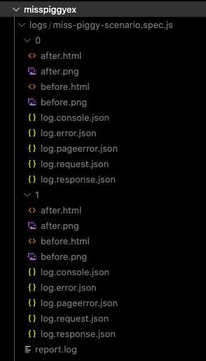

<div align="center"></div>

- [Miss Piggy - Test runner for Puppeteer](#miss-piggy---test-runner-for-puppeteer)
  - [Quick start](#quick-start)
  - [API](#api)
    - [CLI](#cli)
    - [Writing spec files](#writing-spec-files)
      - [Defining a step](#defining-a-step)
      - [Expectations](#expectations)

# Miss Piggy - Test runner for [Puppeteer](https://pptr.dev/)

## Quick start

First install the package via

```
> npm install miss-piggy
```

or 

```
> yarn add miss-piggy
```

Then create a scenario file `miss-piggy-scenario.spec.js` with the following content:

```js
module.exports = {
  description: "Verifying miss-piggy's npm package description",
  steps: [
    [
      "Opening miss-piggy GitHub page",
      async (context) => {
        await context.page.goto(`https://github.com/krasimir/miss-piggy`, {
          waitUntil: "domcontentloaded",
        });
      },
    ],
    [
      "Clicking on the package.json file",
      async (context) => {
        await context.clickByText("package.json");
      },
    ],
  ],
  expectations: [
    {
      where: "html",
      value: "Test runner for Puppeteer",
    },
  ],
};
```

And finally run `./node_modules/.bin/miss-piggy --verbose=1`. The result will be:

```
🖥️  Spec files found in /Users/krasimir/Work/Krasimir/misspiggyex:
  ⚙️ /miss-piggy-scenario.spec.js

-----------------------------------------------------------------

  Description: Verifying miss-piggy's npm package description
  File: miss-piggy-scenario.spec.js

  ⚙️ Opening miss-piggy GitHub page
    ⏳ about:blank
    ⌛ https://github.com/krasimir/miss-piggy
    ✅ html: "Test runner for Puppeteer"

  ⚙️ Clicking on the package.json file
    ⏳ https://github.com/krasimir/miss-piggy
    🛠️  clicking on <a class="js-navigation-open link-gray-dark" title="package.json" href="/krasimir/miss-piggy/blob/main/package.json">package.json</a> (total matches: 3)
    ⌛ https://github.com/krasimir/miss-piggy/blob/main/package.json

  📋 Test summary:

  ✅ All 1 expectations for miss-piggy-scenario.spec.js are satisfied.

  The /logs/miss-piggy-scenario.spec.js/report.log file is generated.

-----------------------------------------------------------------

  ✨ Results:
    ✅ /miss-piggy-scenario.spec.js
```

After the execution of the scenarios the runner creates bunch of logs that show you how the step went. In those logs you'll see how the HTML was before and after the step, screenshots, console log messages, errors and requests. Our little example above for example produced:



## API

### CLI

Arguments that you can pass to the miss-piggy:

| arg | value | description |
| --- | ----- | ----------- |
| --spec | Path to a file. | It runs a single spec file. |
| --specPattern | Regexp string. Default set to "spec\\.js" | A pattern which will match your spec files. |
| --specDir | Path. By default is the directory where the process is started | Defines where the module will search for spec files. |
| --verbose | Default is false | If you pass this argument you'll get a bit more information on what is the current page URL and what the browser is doing. |
| --logDir | Path. By default is set to "logs" | Where the module will place the logs. |

Example:

```
> `./node_modules/.bin/miss-piggy --verbose --spec=./myspecfile.spec.js`
```

### Writing spec files

The overall format of the spec file should be:

```js
module.exports = {
  description: "<text>",
  steps: [ <step definition> ],
  expectations: [ <expectation> ],
};
```

#### Defining a step

There are two ways to define a step. With our without description. Either you provide an array where the first element is the description and the second one is the function or you pass directly the function. Each step function receives a single argument - a `context`. It's an object that contains the following methods/properties:

| property | description |
| --- | ----------- |
| browser | The result of `await puppeteer.launch()` |
| page | The result of `await browser.newPage()` |
| async clickByText(<string or xpath>, selector = '*', idx = 0) | A function that clicks on a element in the page. The first argument is a string or a [xpath](https://developer.mozilla.org/en-US/docs/Web/XPath). The second argument let you specify the tag name of the DOM element. By default is set to `*` which basically means every element. And the last argument of the function is an number specifying which of the matched element to be clicked (if there are more elements matching). |
| async type(<string>, xpath = '//input', idx = 0) | Types the provided string to a DOM element matching the xpath. The index as a third argument is needed if more then one elements is matching. |
| async delay(<interval>) | A function to pause the step. |
| async screenshot() | Well, creates a screenshot. The file is placed in the logs folder |
| async waitForNavigation() | If you need to wait for a page load. It's basically a direct proxy to Puppeteer's [waitForNavigation](https://pptr.dev/#?product=Puppeteer&version=v5.5.0&show=api-pagewaitfornavigationoptions). |
| async getPageURL() | A function that returns the current page URL |
| async content() | It gives you the HTML of the current page |
| pageLog | An array of items that represent console logs/errors and requests happening inside the browser. |

#### Expectations

The expectations are objects with two properties - `where` and `value`. The `where` is specifying the area which you want to expect. And the value is the actual item that you are searching for. Here are the supported pairs at the moment:

Google analytics *dataLayer*.

```json
{
  where: "dataLayer",
  value: ["event", "conversion", { send_to: "xxxx", allow_custom_scripts: true }],
}
```

Search in the HTML. `value` could be also an xpath or RegExp.

```json
{
  where: "html",
  value: "Test runner for Puppeteer",
}
```

Matching the URL by a given string. The `value` could be a string but also a RegExp.

```json
{
  where: "url",
  value: "users/registration/thank-you",
}
```

Matching http request.

```json
{
    where: "request",
    value: {
      method: "GET",
      url: "facebook.net/signals/config/xxxx",
    },
  },
```